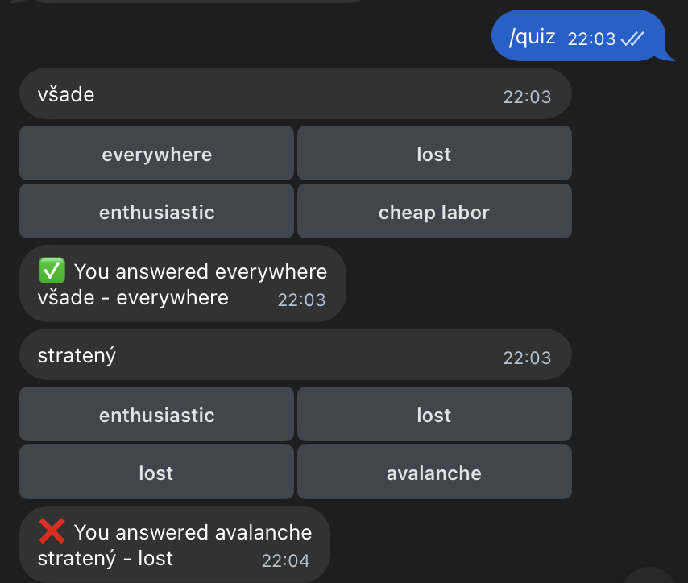

# vocabulary-bot
Telegram bot for storing and practicing Slovak vocabulary.

## Features

### `/add <phrase>`
Checks spelling and translates the phrase to English using OpenAI (diacritics not required).  
Adds the phrase to vocabulary if not exists.

Bot responses:

\+ phaze - translation # added to vocabulary

= phaze - translation # already exists

### `/list`
Shows the entire vocabulary with translations.

### `/quiz`
Starts an endless quiz mode.



## Setup
1. Create and fill .env (See all variables in settings.py)
2. Install dependencies:
```
   pip install -r requirements.txt
```
3. Run migrations:
```
alembic upgrade head
```
4. Run
```
python main.py
```